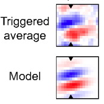
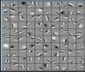

# Filter Bank
Experiment to determine the effectiveness of using hard coded filters for a neural network image classification first layer.

## Objective
The intent of this project was to determine the effectivness of utalizing a pre-configured first layer in a neural net based classifier.  Drawing influence from the receptive fields of visual neurons and their similarity to the usual first layer activations of a trained neural network classifier, the hypothisis was that forcing a first layer filter would improve training accuracy and speed.  

## Background
Biological receptive visual fields have been shown to be Gabor filter (Fig. 1).  Gabor filters also show up artificial neural networks as a first layer analysis (Fig. 2).  

  
   Figure 1.  The measured receptive field triggered average from a mouse compared to a Gabor field model.

  
   Figure 2.  The visual receptive field from an CNN trained on image net. Note the similarity to Gabor filters.  

## Experiment
As the goal of the project was to compare the effectivness of pre-built filters with those learned from the training set, two models were trained on the tiny-imagenet dataset.  The models were both based on Alexnet.  The only difference being that the first layer of the pre-built filter model took in test data that had been preprocessed to include the Gabor filtering.  

## Process
For this project a filter bank was used taken from this publication, as it provided filter bank code https://www.robots.ox.ac.uk/~vgg/research/texclass/with.html.  The code was convereted from Matlab to python.  
