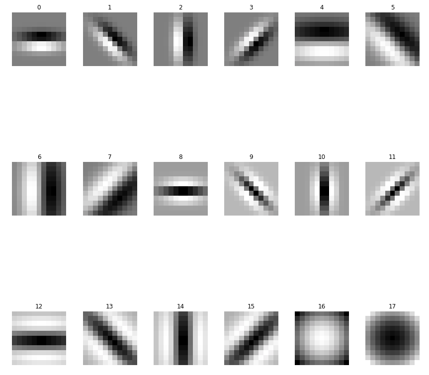
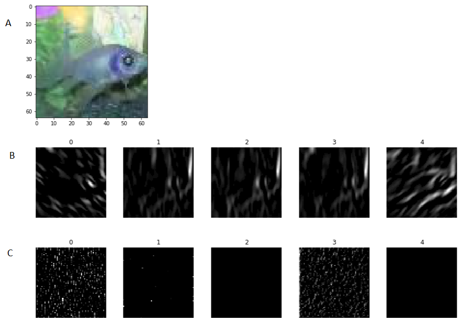

# Filter Bank
Experiment to determine the effectiveness of using hard coded filters for a neural network image classification first layer.

## Objective
The intent of this project was to determine the effectiveness of utilizing a pre-configured first layer in a neural net based classifier.  Drawing influence from the receptive fields of visual neurons and their similarity to the usual first layer activations of a trained neural network classifier, the hypothesis was that forcing a first layer filter would improve training accuracy and speed.  

## Background
Biological receptive visual fields have been shown to be Gabor filter (Fig. 1).  Gabor filters also show up artificial neural networks as a first layer analysis (Fig. 2).  

  
   Figure 1.  The measured receptive field triggered average from a mouse compared to a Gabor field model.

  
   Figure 2.  The visual receptive field from a CNN trained on image net. Note the similarity to Gabor filters.  

## Experiment
As the goal of the project was to compare the effectiveness of pre-built filters with those learned from the training set, two models were trained on the tiny-imagenet dataset.  The models were both based on Alexnet.  The only difference being that the first layer of the pre-built filter model took in test data that had been preprocessed to include the Gabor filtering.  

## Process
For this project a filter bank was used taken from this publication, as it provided filter bank code https://www.robots.ox.ac.uk/~vgg/research/texclass/with.html.  The code was converted from Matlab to python.  This created the filters used for the project (Fig. 3).  These filters were used to create a 64,64,54 tensor object that was treated as the input image (18 filters each operating on all 3 colors in the RGB images).  The models were both trained for 15 epochs and then the results evaluated.

  
   Figure 3.  The Gabor filters used for the preprocessing.  

## Results
The filter bank model did achieve a higher validation accuracy of 25.28% accuracy at the 6th epoch, compared to the traditional models 23.59% accuracy at the 7th epoch (the models were not optimized for the training set to limit scope).  However, with the stochastic nature of the training, it was found that each newly trained model performed similarly.   

Figure 4 shows an input image with some of the filter outputs and some first layer outputs from the traditional model.  This shows one benefit of the model, in having a much more interpretable first layer.  

  
   Figure 4.  A. The input image used.  B. Some of the filter outputs trained on.  Note the ability to discern the fish.  C. First layer outputs from the traditional trained model.  

After training it was seen that the version using the filter banks was significantly slower to train.  This was largely due to running the filtering for each batch before any training could begin.  The code used to run the filters is from open CV and it is not using CUDA code in the background.  This meant the filtering process was significantly slower than the Tensorflow layer the traditional model used.  Had the code been optimized it would have significantly sped the process up.  Another solution would have been to preprocess all of the images, and then saved on the disk, or had the PC enough ram, they could have been held in memory throughout the training process.  However, due to the scope of the project it was decided not to spend much time on optimization.  

## Conclusion
A next step would be to try the filter model on a larger image input size, as a less pixelated image may yield improved results for the filter model.  However, given the industry trend of moving towards larger datasets, more compute, and less preprocessing it is unlikely the filter model will offer any advantage. 

